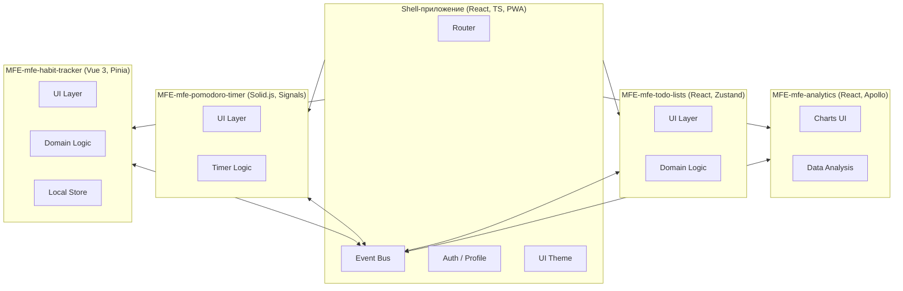
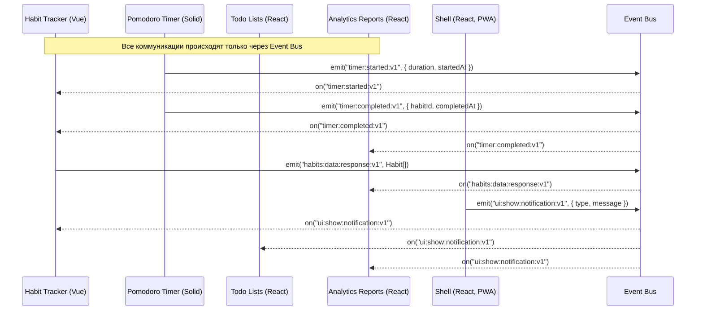

## docs/diagrams.md

````markdown
# Диаграммы архитектуры Polyglot Habit & Productivity Tracker

Этот документ содержит все ключевые диаграммы проекта:

- Компонентная архитектура
- Взаимодействие через Event Bus
- Цикл офлайн-синхронизации
- Развертывание и Runtime Federation

---

## 1. Компонентная архитектура (Shell + MFE)


````

---

## 2. Взаимодействие через Event Bus



---

## 3. Цикл офлайн-синхронизации (SyncManager Flow)

```mermaid
flowchart TD
    U[Пользователь] --> UI[UI Layer (MFE-модуль)]
    UI --> Store[Локальное состояние (Pinia/Zustand/Signals)]
    Store --> DB[IndexedDB (через idb)]
    DB --> Sync[SyncManager (Очередь мутаций)]

    Sync -->|Онлайн| API[GraphQL API (Apollo Server)]
    Sync -->|Офлайн| Queue[(Очередь)]

    Queue -->|Восстановление сети| Sync

    API --> Conflict[Resolver конфликтов]
    Conflict --> DB
    Conflict --> Store
    Conflict --> UI
```

---

## 4. Развертывание и Runtime Federation

```mermaid
flowchart TD
    subgraph Dev["CI/CD Pipeline (GitHub Actions)"]
        A1[Commit to main branch]
        A2[Build MFE-модуль]
        A3[Build Shell]
        A4[Publish artifacts]
    end

    subgraph Deploy["Deployment"]
        CDN1[CDN: habit.example.com/remoteEntry.js]
        CDN2[CDN: timer.example.com/remoteEntry.js]
        CDN3[CDN: analytics.example.com/remoteEntry.js]
        CDN4[CDN: todo.example.com/remoteEntry.js]
        ShellApp[Main domain: app.example.com]
    end

    subgraph Runtime["Runtime Federation"]
        Browser[User Browser / PWA]
    end

    A1 --> A2 --> CDN1 & CDN2 & CDN3 & CDN4
    A1 --> A3 --> ShellApp
    A4 --> Deploy

    Browser --> ShellApp
    ShellApp -.remoteEntry.js.-> CDN1
    ShellApp -.remoteEntry.js.-> CDN2
    ShellApp -.remoteEntry.js.-> CDN3
    ShellApp -.remoteEntry.js.-> CDN4
```
